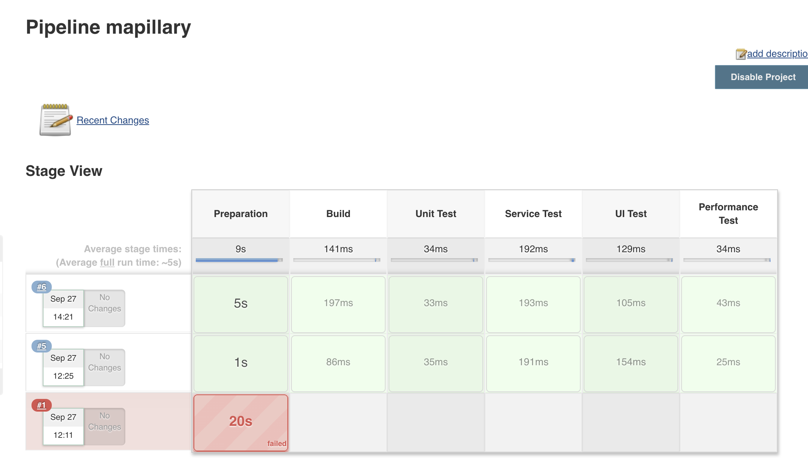

# Project Structure

Before running the application and tests, you find the related information below:

|Component| Description  |
|--|--|
| **app**               | Application develop with Django. There is README about running and unittest.|
|**app/src/tests** | Unit test folder. You find more information about it in README in app.|
|**service-test**    | Service tests are prepeared in Postman and created a collection. For more info, there is a README file in the project.|
|**web-automation**    | For web automation project, test cases are written in BBD with Python so Behave as a framework is used for the project. For more information and how to run in docker, you can find the README file in the project.|
|**performance-test** | Locust is used for performance testing. Performance test should be run against to test environment so need to set the host in the script.|

# CI
For running all the tests as a stage in development process a development pipeline can be preperad in Jenkins. jenkins can be run in a docker but the data should be mounted for persistency. 

```bash
docker run -d -v data-jenkins:/var/jenkins_home:z -p 8080:8080 -p 50000:50000 --name map-jenkins jenkins/jenkins:lts
```

A simple pipeline should be look like this.   
```bash
node(build-slave) {
   stage('Preparation') {
      git 'https://github.com/gunesmes/code-run-test-automation-ci.git'
   }
   stage('Build') {
       sh 'cd /var/jenkins_home/workspace/testhive/app'
       sh 'docker-compose up'
   }
   stage('Unit Test') {
       sh 'cd /var/jenkins_home/workspace/testhive/app/src/test'
       sh 'bash run_unit_tests.sh'
   }
   stage('Service Test') {
       sh 'cd /var/jenkins_home/workspace/testhive/service-test' 
       sh 'bash service_tests.sh'
   }
   stage('UI Test') {
       sh 'cd /var/jenkins_home/workspace/testhive/web-automation'
       sh 'bash run_web_automation.sh'
   }
   stage('Test Deployment') {
   		 sh 'echo live deployment started'
   }
   stage('Performance Test') {
       sh 'bash run_performance_test.sh'
   }
   stage('Live Deployment') {
   		 sh 'echo test deployment started'
   }
}
```





# Test Strategy
Tests in the project are written to cover many possible scenarios. For the agile development methodoly 'contunious testing' is very important because there is an always deployable software package and serving several deployment and/or integrations. Another reason for agile is that the customer requirements can be change during the development just because the market. Therefore the testing strategy should serve these requirements. I think `dynamic/heuristic` testing strategy can help us to cover bussiness needs. Writing automated test to cover most for most risky parts is important and running them on demand even in the live environment is important. What is more, test should be tagged and run parallel to limit testing time for quick feedback. Most time comsuming tests are generally UI related tests so they running inside a separeted docker instances.

Unit tests covers the views, models and forms functionalities. Service tests cover the written services works as expected. To achive the re-runnabality there is an restore process before the service test begin. Service tests are developped with postman which is familiar for most people in software industry. Web automation test are written as BDD for bussiness people to understand them and want to include them to the project. There is an automated load test in the pipeline to give feedback if any flow in the performance of the system.

# Mobile Pipeline
For mobile application, pipeline may be devide into two part. The first part is backen/api development and the seconde pipeline should be for mobile development. 
* For api development; unit tests, service tests should run. Plus the mobile application automated tests should run against the newly developped api services with the application in the live. With this way, any regression issues can be found before the api release.
* For mobile application development, every new commit should trigger the pipeline and mobile test automation should be started after api server and new mobile app package are ready. Compiling app package should be also automated. 


