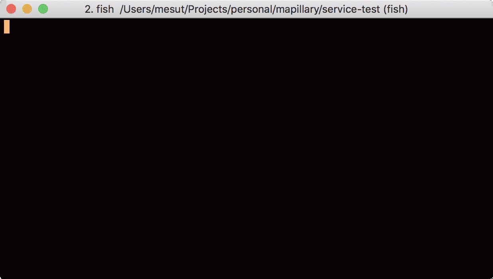

Service test are prepeared in Postman, it can be open via [Postman Collection](https://www.getpostman.com/collections/ac3d0d9bbd8ae1bcfe5d) link. This link is also used for running the collection in Newman docker so other team member can be update it. There is also exported json for collection in the path, name: `testhive.postman_collection.json`


# Demo



# Check the Postman test cases
1. Click [Postman Collection](https://www.getpostman.com/collections/ac3d0d9bbd8ae1bcfe5d)
2. Click the test tab

# Running the service test
## Dockerfile for Newman
Check the Dockerfile in the project. Basically, the base image is node installed Debian, we are installing the required node package which are newma and newman-reporter-html. Then we are running the test inside `newman` folder and the report will be created inside `/newman` folder. This Dockerfile gives us a newman entrypoint which can run it with newman commands


## Run Application to test
Go to app folder and run the project
```
docker-compose up
```

## Running Postman collection in docker
I have create [Newman image](https://hub.docker.com/r/gunesmes/newman-postman-html-report) in hub.docker, so we need to pull it first then we use it.

```
docker run --network host -v $PWD:/newman gunesmes/newman-postman-html-report run https://www.getpostman.com/collections/ac3d0d9bbd8ae1bcfe5d --reporters cli,html --reporter-html-template report-template.hbs
```

## Need to restore data
During the test some data need to be ready. For each run the database should be restored with the script provided in `restore_database.sql`. This file can be run by 
```
bash restore_db.sh
```

## Running on CI
For CI, service tests can be run with 
```
bash run_service_test.sh
```

